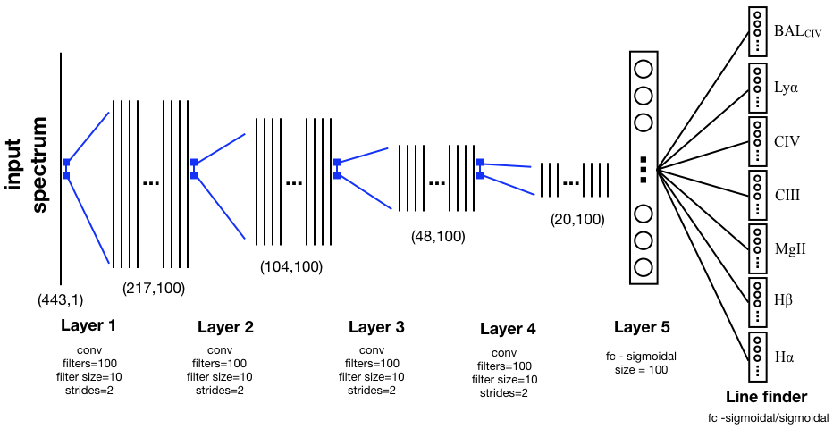

# QuasarNET
## A convolutional neural network for redshifting and classification of astrophysical spectra



Installation instructions (requires python3):

* on a standard system:
```bash
git clone https://github.com/ngbusca/QuasarNET.git
cd QuasarNET
pip install -r requirements.txt --user
python setup.py install --user
```
* at NERSC (specially if you wish to run this notebook at jupyter.nersc.gov)
```bash
conda create -n qnet python=3 qnet scipy numpy fitsio h5py ipykernel
source activate qnet
python -m ipykernel install --user --name qnet --display-name qnet
pip install tensorflow
pip install keras>=2.2.4
git clone https://github.com/ngbusca/QuasarNET.git
cd QuasarNET
python setup.py install
```
#### downloading the data
These data are a reprocessing of data release 12 (DR12) of the Sloan Digital Sky Survey (https://www.sdss.org/dr12/)

They are available on Kaggle: https://www.kaggle.com/ngbusca/qnet_data

A practical way to download the data is to use the kaggle-api, which will allow you to do it from the command line. Otherwise you can simply click the download link on the website.

Download the data to the QuasarNET/data/ directory, unzip the file and set read/write permissions (skip the `kaggle datasets...` line if you've downloaded the data through the website).

```bash
cd data
kaggle datasets download ngbusca/qnet_data
unzip qnet_data.zip
chmod 600 *
```
#### download the pre-trained weights¶
The pre-trained weights are available at: https://www.kaggle.com/ngbusca/qnet_trained_models

Download the weights to the QuasarNET/weights/ directory, unzip the file and set read/write permissions (skip the `kaggle datasets...` line if you've downloaded the data through the website).

```bash
cd weights
kaggle datasets download ngbusca/qnet_trained_models
unzip qnet_trained_models.zip
chmod 600 *
```
